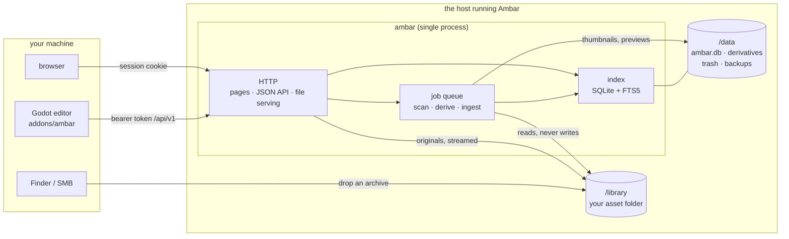

# Architecture

How Ambar is put together, what talks to what, and the handful of rules the code is not
allowed to break. [docs/spec.md](docs/spec.md) is the long-form reference; this is the
map.

## The shape of it

One process. No queue server, no cache server, no worker fleet, no database server.



Everything that takes longer than a request goes through the job queue — scanning,
thumbnails, archive extraction, duplicate reports. HTTP handlers enqueue and return; the
UI polls for status. That is why a scan of 20,000 files can be started from a button.

## The pieces

| Package | What it owns |
| --- | --- |
| `cmd/ambar` | the CLI: `serve`, `scan`, `derive`, `ingest`, `verify`, `rebuild-index`, `backup`, `dupes`, `junk`, `trash`, `user` |
| `internal/config` | every setting, from the environment, validated at startup |
| `internal/db` | SQLite: WAL, one writer connection, a read pool, embedded forward-only migrations |
| `internal/library` | what a file *is* — pack detection, kind classification, junk, format folders |
| `internal/index` | the index and every query: search, groups, sorting, paging, scan reconciliation |
| `internal/search` | the query language parser (`type:model 32x32 -style:realistic`) |
| `internal/tags` | namespaces, hierarchy, aliases, autocomplete, bulk tagging |
| `internal/jobs` | the queue: retries, crash recovery, status |
| `internal/derive` | thumbnails, previews, waveforms, spritesheet detection, palettes |
| `internal/aseprite` | an `.aseprite` decoder, reading the binary format directly |
| `internal/model` | glTF/OBJ normalisation and metadata |
| `internal/palette` | colour extraction and `color:` search |
| `internal/ingest` | archive extraction with path-traversal defences, provenance capture |
| `internal/provenance` | where a pack came from, and under what licence |
| `internal/projects` | which Godot project uses which asset; `CREDITS.md` |
| `internal/removal` | duplicates, the trash, and everything that refuses to delete |
| `internal/ops` | verify, rebuild-index, backup |
| `internal/auth` | argon2id passwords, sessions, CSRF, API tokens and scopes |
| `internal/server` | routing, handlers, and the HTML templates |
| `internal/safepath` | resolving any path against a root, on every filesystem operation |
| `addons/ambar` | the Godot editor plugin (GDScript) |

## Storage layout

```
/library                       your files, exactly as you arranged them
  _inbox/                      drop archives here; ingest picks them up
  _archives/                   ingested originals, kept
  2d/ 3d/ audio/ …             "buckets": folders that group packs
    some-pack/                 a pack — detected, or declared by .ambar.json
      …/sprite.png             an asset
      …/sprite.psd             a *variant* of the same asset, not a second one
  …/.ambar.json                optional sidecar: metadata that travels with the folder

/data                          everything Ambar generates
  ambar.db                     the index (+ -wal, -shm)
  derivatives/<ab>/<sha256>/   thumb.webp, preview.webp, preview.glb, peaks.json …
  trash/                       what a removal moved, with a record of where it was
  backups/                     VACUUM INTO snapshots
```

Derivatives are keyed by **content hash**, not by path or id. Two identical files share
one thumbnail, and moving a file does not invalidate anything.

## Data flow

**Scanning.** Walk the library, decide what is a pack and what is junk, hash what is new
or changed (detected by size and mtime), reconcile against the index: a moved file keeps
its row and its id, a missing file is marked rather than deleted, and a library that
suddenly looks empty aborts the scan instead of flagging everything. Then group format
variants, then enqueue derivatives for anything that lacks them.

**Deriving.** A job per asset. Images get a thumbnail and a preview, with the pixel-art
path — nearest-neighbour, never smoothed, decided by colour count and edge hardness
rather than image size. Audio gets peaks. Models get a normalised `preview.glb` and
geometry counts. Anything with no pure-Go decoder is recorded as `unsupported` with a
reason, which is a state, not a failure.

**Ingesting.** An archive in `_inbox/` (or uploaded) is extracted into the library with
every entry path resolved and checked against the destination root, then classified,
then indexed. Provenance is asked for at that moment, because that is the only moment
anyone knows the answer.

**Importing (Godot).** The plugin searches the API, downloads the original, verifies its
hash against what the server advertised, writes `res://.ambar/manifest.json` and posts a
"use" to the server. The manifest is committed; the server's record is what
`CREDITS.md` is built from and what protects the asset from any removal list.

## The rules

These are not style preferences. Violating one is a bug regardless of what else works.

1. **Originals are never modified, moved or renamed.** The only exception is a removal a
   human explicitly selected. Sidecars may be written beside them; the files themselves
   are read-only.
2. **The filesystem is the source of truth; SQLite is a rebuildable index.** Nothing
   lives only in the database, and `ambar rebuild-index` must actually reconstruct
   everything from the filesystem and its sidecars.
3. **The application never deletes anything on its own.** No scheduled cleanup, no
   pre-selected rows, no automatic trash purge, no deletion as a side effect of a scan.
   It detects and reports; the human selects.
4. **The last remaining copy of any content hash can never be removed** — enforced in
   code, not by a UI flow.
5. **Anything a Godot project uses is never a removal candidate.**
6. **No CGO.** The binary must stay statically linkable, which is why the SQLite driver
   is `modernc.org/sqlite`.
7. **Format variants are not duplicates.** The PNG, PSD and ASEPRITE of one artwork are
   one logical asset and are never surfaced as redundant copies.
8. **No long-running HTTP handlers.** Ingest, scan and derive work goes through the job
   queue with pollable status.
9. **Path-traversal defence on every filesystem operation**, serving as much as
   ingesting. No path is ever built from user input without resolving it and confirming
   it stays under the configured root.
10. **A project's identity is a UUID, never a filesystem path** — two people check the
    same project out at different paths.

## Choices worth knowing

- **SQLite, not Postgres.** One process, one file, and the index is disposable by
  design. FTS5 under `modernc.org/sqlite` was verified before anything was built on it;
  `internal/db/fts5_test.go` keeps that assertion permanent, because a dependency bump
  that silently dropped FTS5 would break search with no other signal.
- **Server-rendered HTML with htmx, no SPA.** JavaScript exists as three isolated
  islands — the 3D viewer, canvas zoom, the audio waveform — and is vendored, so there
  is no build step and the CSP can stay strict.
- **Keyset paging for the API, offset paging for the grid.** A cursor is stable while
  the library changes underneath it, which is what a client walking everything wants; it
  cannot produce "page 4", which is what a person wants. Both exist, and mixing them is
  what the code refuses to allow.
- **External tools are optional and never baked into the image.** Blender, Aseprite and
  ffmpeg are configured by path. Without Blender, `.fbx` and `.blend` sit in
  `needs_blender` and say so — and the Godot plugin fills that gap for the formats it
  can read by rendering them itself.
- **Content hash is identity** for derivatives, duplicate detection, and now for
  attribution: a project use recorded against an id whose content does not match is
  corrected from the hash.

## Testing

`make check` is gofmt, vet and the full Go suite. Beyond the ordinary unit tests, a few
places are pinned deliberately:

- a scan cycle hashes every library file before and after and asserts the set is
  byte-identical, mtimes included
- archive extraction is tested against deliberately malicious paths
- every deletion invariant above has a test that tries to violate it
- `rebuild-index` is tested for fidelity, not just for not crashing
- the `.aseprite` decoder is compared pixel-by-pixel against vendor PNG exports of the
  same artwork, when a corpus is available (`AMBAR_ASEPRITE_CORPUS`)

The Godot plugin cannot be reached by any of that, and a GDScript parse error leaves an
addon that is enabled and does nothing, with the only evidence in the editor's Output
panel. `godot-test/` is a project whose `addons/` symlinks to the working tree, and
`make godot-test` runs the parse check, an API drive, an import, the project screen,
model rendering and a UI screenshot pass.
